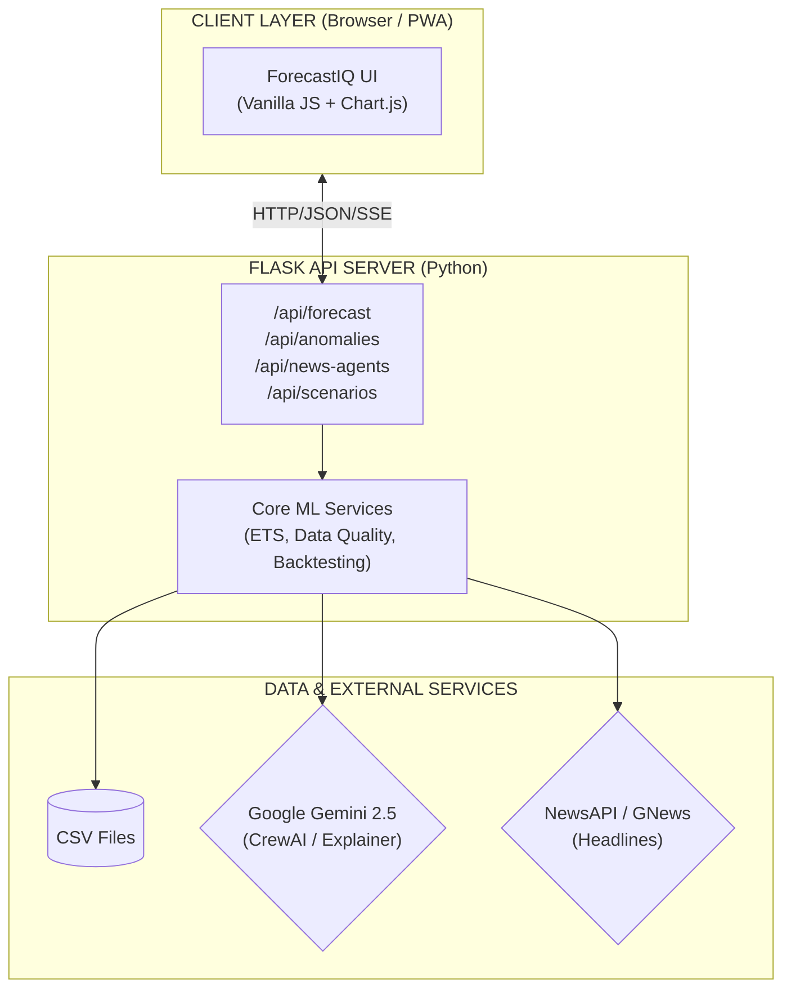
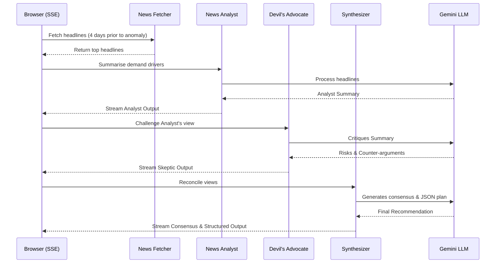

# ForecastIQ — AI Predictive Forecasting Tool

> **Look ahead instead of backwards.** Transform historical time-series data into honest forecasts with uncertainty ranges, anomaly alerts, scenario comparison, walk-forward backtesting, and multi-model selection.


---

## Overview

**ForecastIQ** is a full-stack AI-powered predictive forecasting tool that helps teams make better decisions by understanding what the future may look like. It transforms CSV time-series datasets into actionable forecasts with honest uncertainty ranges, anomaly alerts, side-by-side scenario comparisons, and plain-English AI explanations.

---

## Features

### Core Capabilities
- **Plan Ahead (Forecasting):** Generates short-term forecasts with low/likely/high confidence bands and seasonal decomposition.
- **Spot Trouble (Anomaly Detection):** Flags unusual spikes and dips using Z-score, IQR, and residual methods, scoring severity and providing AI-suggested next steps.
- **Compare Plans (Scenarios):** Side-by-side forecasts with growth-rate sliders, trend adjustments, and outlier removal.

### Advanced AI Agents
- **Market Intelligence (CrewAI + NewsAPI):** A multi-agent debate system that activates upon anomaly detection.
  - *News Analyst:* Summarizes recent relevant headlines fetched via News API (NewsAPI.org/GNews).
  - *Devil's Advocate:* Challenges conclusions and flags risks.
  - *Synthesizer:* Reconciles views into a clear, actionable recommendation with a confidence score.
- **Rule-Based Parameter Agent:** Automatically analyzes data volatility (Coefficient of Variation) and size to recommend optimal forecast horizons and confidence intervals, preventing user guesswork.
- **Multilingual Explainer:** Generates natural-language summaries of forecasts and anomalies using Gemini AI, with multi-language support.

### Additional Features
- **Multi-Model Horse Race:** Compares ETS, ARIMA(1,1,1), and Moving Average simultaneously, ranking them by MAPE.
- **Walk-Forward Backtesting:** Validates accuracy on held-out historical data.
- **Data Health Score:** Evaluates completeness, regularity, and seasonality.

---

## Architecture

### 1. High-Level Design (HLD)
The system is divided into an independent Single Page Application (SPA), a Python REST API, and external AI/data services.



### 2. Market Intelligence (CrewAI Multi-Agent Flow)
When an anomaly is detected, three agents sequentially debate recent news to explain the event and suggest actions.




---

## Tech Stack
- **Frontend**: HTML5, Vanilla CSS, Vanilla JavaScript (ES6+), Chart.js 4.4.7
- **Backend**: Python 3.12, Flask 3.1
- **Forecasting / ML**: `statsmodels`, `numpy`, `pandas`, `scikit-learn`
- **AI / Multi-Agent**: CrewAI, Google Gemini 2.5 Flash, NewsAPI / GNews fallback

---

## Install and Run

1. **Clone the repository:**
   ```bash
   git clone https://github.com/Shubh-Raj/ForecastIQ.git
   cd ForecastIQ
   ```

2. **Set up Virtual Environment:**
   ```bash
   python3 -m venv venv
   source venv/bin/activate
   pip install -r requirements.txt
   ```

3. **Environment Variables:**
   ```bash
   cp .env.example .env
   ```
   Add your API keys to `.env`:
   - `GEMINI_API_KEY`: Required for AI explanations and CrewAI agents.
   - `NEWS_API_KEY` / `GNEWS_API_KEY`: Required for fetching market headlines.

4. **Start the Application:**
   ```bash
   # Generate sample data first
   python scripts/generate_sample_data.py
   
   # Run the server
   python src/backend/app.py
   ```
   Open **http://localhost:5000** in your browser.
